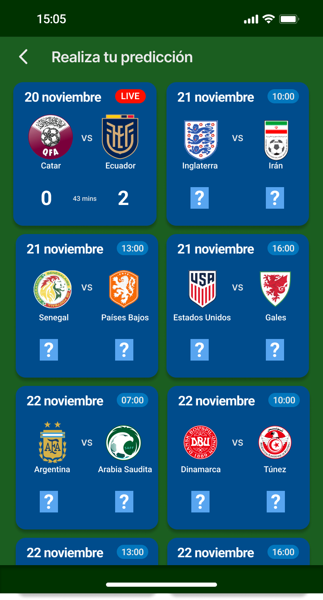

# Informe académico entrega 2

Fecha de entrega: 28-nov-2022

## **Construcción**

Implementación de funciones principales (sin la necesidad de persistencia de datos)

La segunda entrega de este trabajo consta de una implementación parcial del proyecto. Se considerarán algunos de los casos de usos especificados anteriormente y se codificaran para su funcionamiento en la aplicación. 

Los casos de uso en cuestión serán el UC#3, que presenta la posibilidad de crear grupos de usuarios para competir por pencas, y el UC#4, que consta de poder ingresar la predicción del resultado de un partido dado.

Se adjuntan a continuación los casos de uso en cuestión con mayor detalle:

**UC #3**

Título: Crear un grupo

Requerimientos: RF12

Actor: Usuario

Precondición: -

Curso:

Poscondición: Se muestra el grupo en la lista de grupos. Además, se muestra entre los grupos a los que pertenece el usuario.

Cursos alternativos: 

5.1: En caso de que el nombre del grupo ya existe, le pide al usuario ingresar un nombre distinto.

     

**UC #4**

Título: Ingresar una predicción

Requerimientos: RF3

Actor: Usuario

Precondición: Debe existir algún partido pendiente

Curso:

Poscondición: La predicción queda registrada en el sistema y se muestra para el usuario que la hizo.

Cursos alternativos:

3.1: Si no hay partidos por jugar, no puede predecir ninguno. Fin del caso de uso.

5.1: Si el resultado no es válido (tiene valores negativos o letras), se pide reingresar.

     

Configuración de plataforma tecnológica para desarrollo y producción

La tecnología utilizada para programar la penca será Node.js. Se trata de un entorno para el servidor en tiempo de ejeccución. Se usará HTML, con CSS inclinado al diseño y JavaScript para programar el back-end.

Documentación del uso de librerías externas (package.json)

Como se explicará más adelante, se trabajará con material design web components. Cada componente constituye su propia librería, por lo que es conveniente detallar los componentes usados en esta sección:

- Tab bar (para el menú inferior)
- Cards (para partidos)
- Data tables (para grupos)
- Banners (para header y noticias)
- Buttons

## **Interfaz de usuario**

Interfaz de usuario web / mobile (responsive)

Es necesario que la pagina web tenga una interfaz que se adapte según la pantalla en la que se esté mostrando. Al usar NodeJS, el proyecto ya de por si se adapta a distintos tamaños de display, por lo que no deberemos invertir mayor esfuerzo en eso. Adicionalmente, utilizar componentes de material design hace que esto sea posible, ya que los componentes también son responsivos.

Página única con navegación entre secciones

Para facilitar la navegación y dejar mejor organizado el código, la web deberá de consistir de solo una página. Se dividirá todos los elementos de la aplicación en secciones y se mostrarán en pantalla únicamente los que formen parte de la sección seleccionada. El resto de componentes permanecerán ocultos. A través de un tab bar ubicado en la zona inferior de la pantalla podemos cambiar de una sección a otra. De esta manera logramos navegar entre distintas áreas de la aplicación, cada una con sus propios elementos y funcionalidades, todo desde una única página.

Implementación: Material Design Web Components

Como ya se mencionó anteriormente, se utilizaran material design web components de Google para formar la aplicación. Se tratan de librerías para web que brindan elementos y componentes para la interfaz desarrollados por ingenieros y diseñadores de Google. De esta manera, nos garantizamos seguir estándares visuales (ya que los usuarios tienden a estar acostumbrados a usarlos). 

Estos componentes también son altamente personalizables, por lo que podemos modificarlos tanto como sea necesario para conseguir que se adecuen a nuestras necesidades. Podemos cambiar tamaño, color, imágenes e iconos, funcionalidad, posición, etc. haciendo que puedan utilizarse para solventar virtualmente cualquiera de nuestras necesidades de manera sencilla, ya que su implementación es sencilla (solo hay que seguir los pasos detallados en la pagina de material design para cada componente que queremos usar).

Aplicar un sistema de diseño y principios de usabilidad

Para el diseño de esta aplicación, se tomó como referencia otras disponibles que cumplen funciones similares, tales como OneFootball o ForzaFootball. Se tomaron sus interfaces como referencia, asegurándonos de esta manera de que el resultado final tenga una interfaz estética, fácil de usar y comprensible para los usuarios, ya que el público objetivo está acostumbrado a su estructura. Adicionalmente, usar Material Design Web Components nos permite formar la interfaz con elementos ideados por Google, por lo que el usuario estará acostumbrados a ellos y conocerá su funcionamiento, siendo cómodo su uso.

En cuanto respecta a la usabilidad y accesibilidad, se buscó cumplir las heurísticas de Nielsen:

- Visibilidad del estatus del sistema: Todas las acciones generan una reacción, por lo que es fácil encontrar botones, tabs, etc., así como saber cuando ocurre un cambio (se guarda predicción, por ejemplo).
- Vínculo entre el sistema y el mundo real: Los elementos del sistema se presentan de manera tal que el usuario promedio pueda entenderlo. No se usan notaciones ni términos complejos, específicos del entorno, se usan palabras e ideas que el usuario conoce y entiende.
- Libertad y control del usuario.
- Consistencia y estándares: como ya se mencionó, la IU está diseñada de manera que el usuario conozca todos los elementos y sepa interactuar con ellos.
- Prevención de errores: las acciones que llevan a problemas en el sistema (poner que un equipo va a meter una cantidad negativa de goles, por ejemplo) se evitan a través de alertas.
- Reconocimiento en vez de memorización: se usan iconos y botones que el usuario puede relacionar sencillamente con su función.
- Flexibilidad y eficiencia de uso: el sistema puede ser usado por gente experimentada en estas aplicaciones, así como novatos en las pencas. Es flexible y se adapta a todos los usuarios.
- Diseño minimalista.
- Ayuda al usuario a reconocer, diagnosticar y recuperarse de errores: se alertan los posibles errores y se puede regresar a pasos anteriores.
- Ayuda y documentación: existen informes con información del funcionamiento del sistema para guiar al usuario.

Cumplimiento de estándar de accesibilidad WCAG

Nuestra intención es hacer que la mayor cantidad de personas puedan utilizar nuestra aplicación, por esta razón no solo hicimos que la aplicación fuera adaptable a diferentes dispositivos, sino que también buscamos implementar reglas WCAG para permitirnos llegar a más usuarios.

Web Content Accessibility Guidelines (WCAG), son pautas que indican cómo hacer el contenido de la web accesible para personas con discapacidad.

Reglas con las que cumplimos y buscamos cumplir para dar mayor accesibilidad:

- Alternativas a texto
    - El sistema busca ser una aplicación intuitiva utilizando mayormente imágenes, sobre todo en las funciones principales.
- Distinguible
    - El sistema posee colores muy diferentes que permiten a casi cualquier usuario (hasta aquellos con visión reducida) diferenciar los componentes.
    - Se espera implementar la posibilidad de cambiar el tamaño del texto para versiones futuras.
- Accesible con diferentes interfaces
    - Queremos que el sistema sea completamente funcional ya sea solo con teclado o solo con un mouse. Tambíen (ya implementado) el utilizarla por medio del touch.
- Legible
    - Cuando el sistema usa texto, a excepción de las noticias, el texto mostrado en pantalla es simple y descriptivo.
    - Existirá la posibilidad de cambiar el idioma.

Seguir especificación de estilo

si ⚽

## **Codificación**

IDE Visual Studio Code: configuración común del equipo

El IDE utilizado durante todo el proyecto será Visual Studio Code de Microsoft. No se realizaron grandes cambios de configuración para la realización del trabajo. No obstante, cabe destacar el uso de LiveShare, una extensión muy útil que fue muy relevante a lo largo de todo el proceso de desarrollo. Esta nos permite trabajar todos sobre el mismo código al mismo tiempo, conectándonos con un link al repositorio local de uno de los miembros

Estándares de codificación Google (HTML, CSS, JavaScript)

Buscamos desarrollar un código claro, prolijo y comprensible. Para esto seguiremos los estándares de codificación de Google, ya que son de los más aceptados y populares. Usaremos esLint (se explica a continuación) para poder verificar que nuestros códigos cumplen el estándar, y arreglarlo de manera automática en caso de que no sea así. Esta herramienta también nos permite establecer reglas personalizadas que nosotros consideramos convenientes.

Buenas prácticas de OOP: separación de lógica e interfaz

Buscando prolijidad y claridad, se separa la lógica de la interfaz. De esta manera, todo el código relacionado con la interfaz de usuario se colocará en un directorio separado. Así mismo, las clases están separadas de el código que las relaciona con la interfaz. Por ejemplo, la clase partido no se encuentra junto con el código que crea una carta en la pantalla de inicio para mostrar en ella los datos del partido.

Análisis estático de código: mostrar reducción de problemas

El análisis estático de código se trata en realizar comprobaciones de manera automática sobre el código fuente para encontrar errores e incongruencias. A través de él, podemos hallar problemas en el código y resaltarlos, facilitando encontrarlos y, posteriormente, arreglarlos.

Para esto, usaremos esLint, herramienta de linting que además de resaltar los problemas, nos permite solucionarlos automáticamente. Además, nos permite personalizar todo, seleccionando los estándares que buscamos seguir, las reglas adicionales que implementamos nosotros, entre otros.

Para instalarlo corremos npm install eslint. Para inicializarlo, desde nuestro directorio de NodeJS, corremos `npx eslint --init`. Ahora seleccionamos todos los estándares que queremos para nuestro proyecto. Finalmente, para analizar un archivo corremos `npx eslint <DireccionDelArchivo>`. 

En muchos casos, los errores pueden solucionarse automáticamente. Para esto debemos usar `npx eslint <DireccionDelArchivo> --fix`.

## **Test unitario**

¿Que es el testing? 
En la tecnología, testear el código significa verificar que el mismo cumple con las expectativas. Es decir, por ejemplo, que habiendo creado una función A, la misma de la salida esperada con una entrada especifica.

Para verificar la funcionalidad del código de la pagina web hicimos uso de Jest, una librería de JavaScript que tiene como objetivo crear, correr y estructurar tests. Jest es uno de los programas de testeo mas populares actualmente y tiene uso en proyectos de web.

Para instalar Jest es necesario instalarlo, para ello hay que correr `npm install --save-dev jest`. 

El código que debíamos de testear, son las clases ejemplo.mjs del dominio. Para ello se debe de crear un archivo ejemplo.test.js de cada una de ellas con el objetivo de cubrir en el testeo todas las funciones y el constructor de las clases. 

Finalmente, luego de poner todas las expectativas de las salidas de nuestro código según la entrada, para correr el test hay que escribir el siguiente comando en la terminal `npm run test`. Y los resultados aparecerán en la terminal misma.

Jest pondrá en rojo las pruebas que no han cumplido con las expectativas y en verde las pruebas correctas. También nos dirá si nos falto cubrir alguna linea en alguna clase. Cuando todas las pruebas estén correctas y todas las lineas estén testeadas, se podría decir que finalizaste el testeo.

En la semana previa a la entrega se debe congelar el desarrollo (22-nov-2021). A partir de este punto solo se realizan actividades de test de sistema, reporte de issues y generación del informe académico.

## **Test de sistema**

Realizar test de sistema en un entorno separado del desarrollo

Generar casos de prueba aplicando técnica partición equivalente

Detallar sesiones de prueba exploratoria

## **Reporte de issues**

Reportar issues (bugs, improvements, missing features) en GitHub

Aplicar buenas prácticas de reporte de issues

Definir labels para tipos de issue y niveles de severidad

Dejar issues abiertos para correcciones o mejoras futuras

Sumarizar número de issues reportados por tipo

Realizar una evaluación global de la calidad

## **Reflexión**

Detalle del trabajo individual

Técnicas aplicadas y aprendizajes